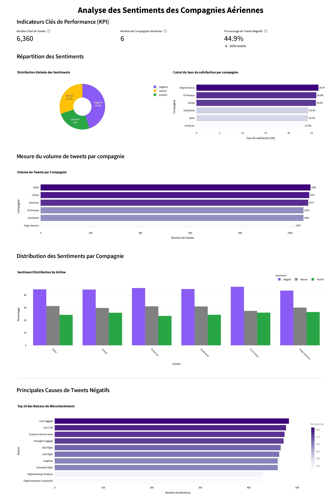
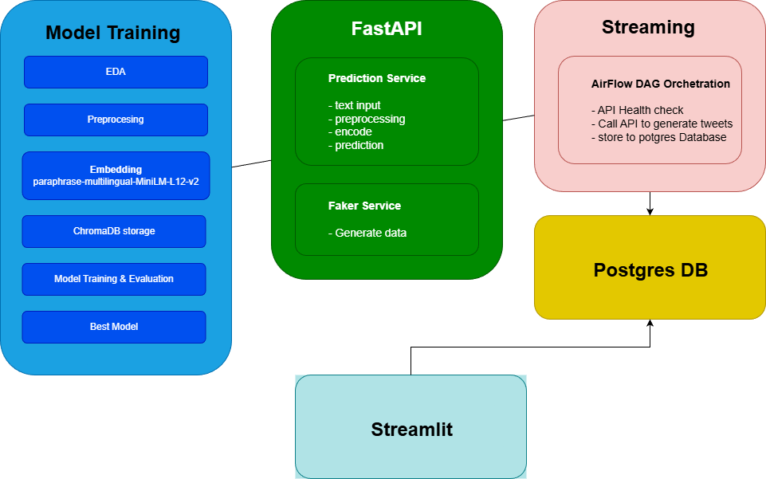

AeroStream est une plateforme d'analyse de sentiments en temps réel pour les tweets concernant les compagnies aériennes américaines. Le système collecte, nettoie, analyse et visualise les sentiments des clients en utilisant des techniques avancées de Machine Learning et NLP.

Cette solution intelligente permet aux compagnies aériennes de surveiller en continu les retours clients sur les réseaux sociaux, d'identifier rapidement les tendances négatives et de réagir proactivement pour améliorer l'expérience client.

## Dashboard

## Problématique

Comment concevoir un système intelligent capable d'automatiser le traitement des retours clients pour réduire le temps de réaction des compagnies aériennes face aux critiques, en utilisant l'analyse prédictive pour identifier les tendances d'insatisfaction émergentes ?

## Objectif Principal

Développer une solution simple, sécurisée, évolutive et agréable à utiliser qui permet de :
- Automatiser la collecte et l'analyse des tweets en temps réel
- Prédire les sentiments (positif, négatif, neutre) avec une haute précision
- Visualiser les tendances et insights pour faciliter la prise de décision
- Réduire significativement le temps de réaction face aux critiques clients

## 🛠️ Technologies

- **Backend**: Python, FastAPI
- **Machine Learning**: Scikit-learn, TensorFlow/PyTorch
- **NLP**: NLTK, spaCy, Transformers
- **Base de données**: PostgreSQL
- **Orchestration**: Apache Airflow
- **Containerisation**: Docker, Docker Compose
- **Visualisation**: Streamlit
- **Vector Database**: ChromaDB
- **API**: RESTful API

## 🏗️ Architecture

L'architecture suit un pattern modulaire avec les composants suivants :
- **ETL Pipeline** : Extraction, transformation et chargement des données via Airflow
- **API Backend** : Service FastAPI pour les prédictions et la gestion des données
- **Base de données** : PostgreSQL pour le stockage structuré
- **ChromaDB** : Base de données vectorielle pour les embeddings
- **Interface utilisateur** : Dashboard Streamlit pour la visualisation
